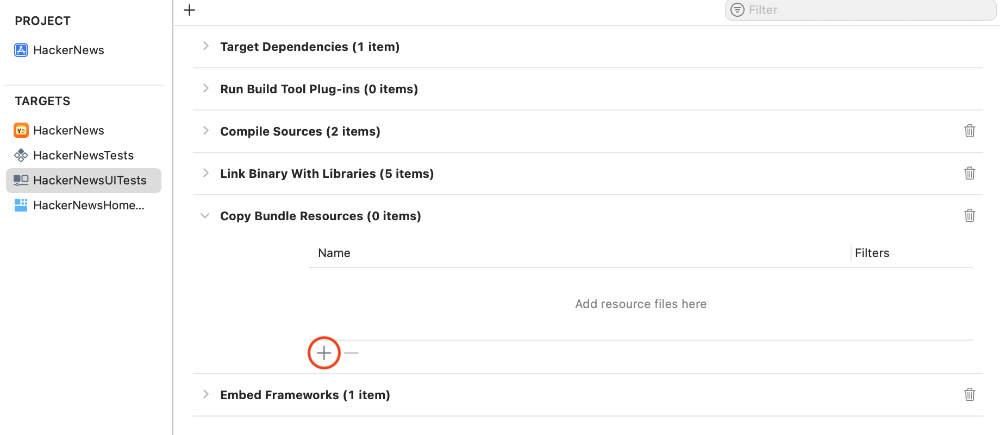
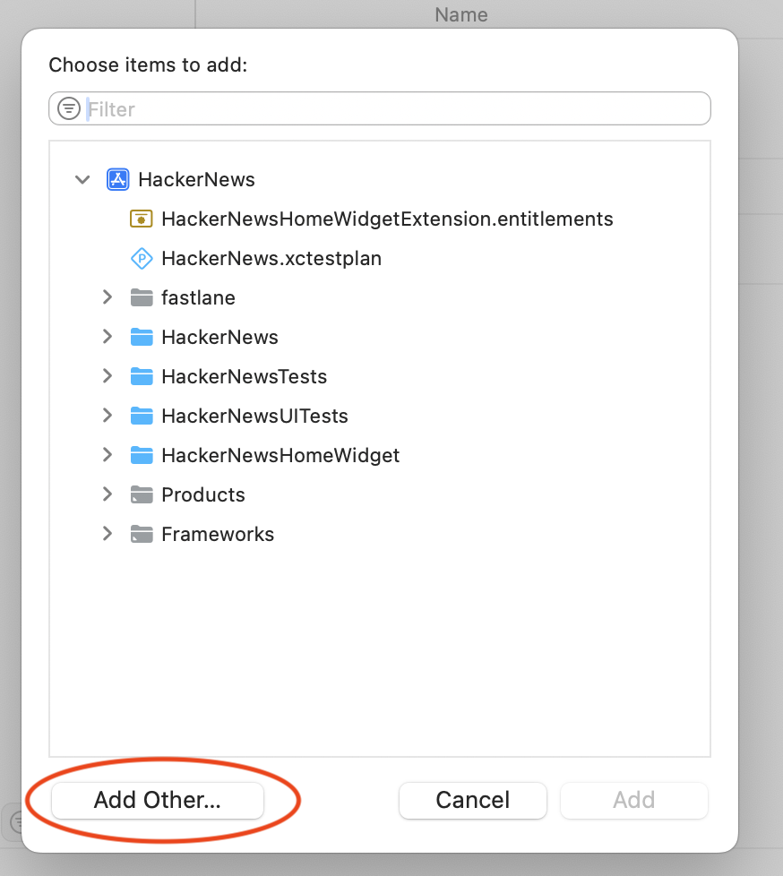
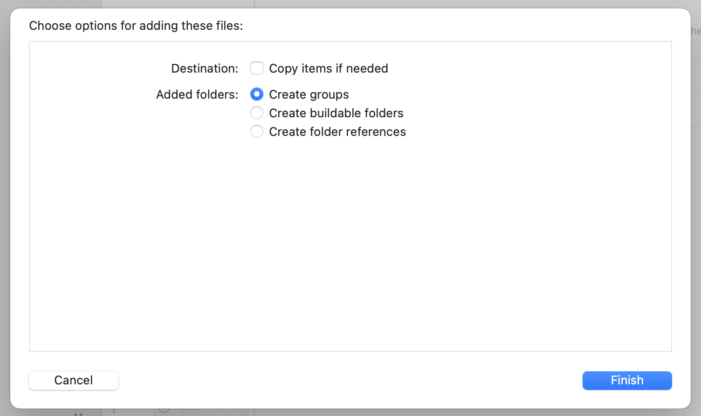

# FaultOrdering

Order files can reduce app startup time by co-locating symbols that are accessed during app launch, reducing the number of page faults from the app. This package generates an order
file by launching the app in an XCUITest. Read all about how order files work in [our blog post](https://www.emergetools.com/blog/posts/FasterAppStartupOrderFiles).

## Setup

Setting up your app to use order files requires 2 general steps:

1. Generate an order file from an XCUITest. `FaultOrdering` instruments app launch in the UI test and uses the results to generate an optimized order file.
2. Once the order file is generated, build the app again, this time passing the order file as an option to the linker.

### Package installation

- Create a UI testing target using XCUITest.
- Add https://github.com/getsentry/FaultOrdering to your project via Swift Package Manager.
- Add `FaultOrderingTests` and `FaultOrdering` as dependencies of your new UI test target.

### Generating the linkmap

In your app's Xcode target, set the following build settings:

```
LD_GENERATE_MAP_FILE = YES
LD_MAP_FILE_PATH = $(PROJECT_DIR)/Linkmap.txt
```

After adding these settings, make sure to build your app and verify the file exists.

> [!NOTE] We recommend using `$(PROJECT_DIR)` so that it generates within your project directory instead of derived data, but this can be changed to whatever makes sense for your setup.

### Including the linkmap

Add `Linkmap.txt` in the build phases for your UI test target under Copy Bundle Resources.

> [!IMPORTANT] Do **not** check the box to copy the file.




Choose "Add Other" and browse to where you generated the file. You may need to create the file first, by building your main app target once with the new build settings.


Confirm your selection and <strong>do not</strong> check the box to copy the file.

> [!NOTE]
> You don't need to specifically use `"$(PROJECT_DIR)/Linkmap.txt"` as the path. Whatever value is set in `LD_MAP_FILE_PATH` is also the file that you include in Copy Bundle Resources.

## Generating the order file 

In a UI test case, create an instance of `FaultOrderingTest` and optionally provide a closure to perform any necessary app setup. 

> [!TIP] In most cases, this should include logging in to the app. Centering your UI test around a fully logged in session is strongly recommended, not only because it optimizes for the most common user experience, but also because it significantly improves the efficacy of this tool. By logging in, you allow much more of the app’s initial code to execute within the test context, allowing for a greater number of page fault reductions.

Example:

```swift
import FaultOrderingTests
import XCTest

final class FaultOrderingLaunchTest: XCTestCase {
    @MainActor
    func testLaunch() throws {
        let app = XCUIApplication()
        let test = FaultOrderingTest { app in
            // Perform setup such as logging in
        }
        test.testApp(testCase: self, app: app)
    }
}
```

The test case can then be executed.

> [!IMPORTANT]
> This test should run with the same compiler/linker optimizations that you would use for your App Store deliverable.

### Device support

To run on a physical device, the app must link to the `FaultOrdering` product from this package. Update your main app target to include this framework in its embedded frameworks. If your app takes a different codepath on physical devices than simulators (such as using device only frameworks like Metal) it is best to generate an order file while running on the physical device.

## Accessing results

After running the UI test, the order file will will appear as an XCTAttachment named `"order-file"`.

## Using the order file

In your app target's build settings, set "ORDER_FILE" to the path to your order file and rebuild the app.

> [!TIP] Technically, the app only needs to be relinked to include the order file, as it has no effect on compilation of source code, but it may be easier to simply rebuild the entire app target.
